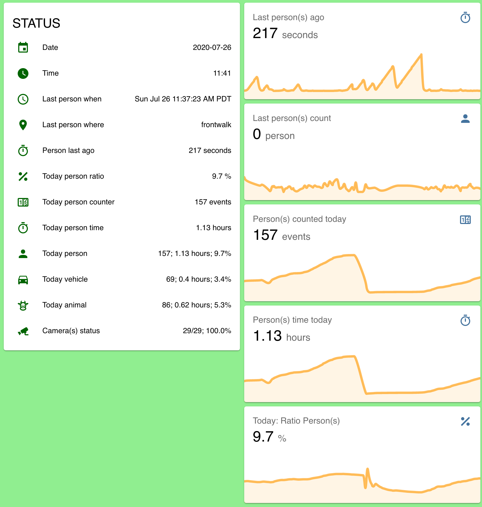

#  Motion &Atilde;&#128065;
An open-source software solution for situational awareness from a network of video and audio sources.  Utilizing [Home Assistant](http://home-assistant.io), [addons](http://github.com/motion-ai/addons), the LINUX Foundation [Open Horizon](http://github.com/open-horizon) edge fabric, and [edge AI services](https://github.com/motion-ai/open-horizon), the system enables _personal_ AI on low-cost devices (e.g. RaspberryPi); integrating object detection and classification into a dashboard of daily activity.

+ Use this [guide](docs/QUICKSTART.md) to get started.
+ Visit us on the [Web](http://www.motion-ai.com)
+ Find us on [Facebook](https://www.facebook.com/groups/motionai/)
+ Connect with us on [LinkedIn](https://www.linkedin.com/company/motion-%C3%A3i)
+ Message us on [Slack](https://join.slack.com/t/motionai/shared_invite/zt-gdf19rup-zIseUFLoLSD0NkC5hpr~EQ)


### What  is _edge AI_?
The edge of the network is where connectivity is lost and privacy is challenged.

Low-cost computing (e.g. RaspberryPi, nVidia Jetson Nano, Intel NUC) as well as hardware accelerators (e.g. Google Coral TPU, Intel Movidius Neural Compute Stick v2) provide the opportunity to utilize artificial intelligence in the privacy and safety of a home or business.

To provide for multiple operational scenarios and use-cases (e.g. the elder's _activities of daily living_ (ADL)), the platform is relatively agnostic toward AI models or hardware and more dependent on system availability for development and testing.

An AI's **prediction quality** is dependent on the  _variety_, _volume_, and _veracity_ of the training data (n.b. see [_Understanding AI_](https://www.linkedin.com/pulse/understanding-ai-david-c-martin/), as the underlying deep, convolutional, neural-networks -- and other algorithms -- must be trained using information that represents the scenario, use-case, and environment; better predictions come from better information.

The Motion &Atilde;&#128065; system provides a _personal AI_ incorporating both a wide variety artificial intelligence, machine learning, and statistical models as well as a closed-loop learning cycle (n.b. see [_Building a Better Bot_](https://www.linkedin.com/pulse/building-better-bot-david-c-martin/)); increasing the volume, variety, and veracity of the corpus of knowledge.

## Composition
The `motion-ai` solution is composed of two primary components:

+ [Home Assistant](http://home-assistant.io) - open-source home automation system
+ [Open Horizon](http://github.com/open-horizon) - [edge AI](http://github.com/dcmartin/open-horizon)  platform

Home Assistant _add-ons_:

+ [`motion`](http://github.com/motion-ai/addons/blob/master/motion/README.md) - _add-on_ for Home Assistant - captures images and video of motion (n.b. [motion-project.github.io](http://motion-project.github.io))
+ [`MQTT`](https://github.com/home-assistant/hassio-addons/blob/master/mosquitto/README.md) - messaging broker 
+ [`FTP`](https://github.com/hassio-addons/addon-ftp/blob/master/README.md) - optional, only required for `ftpd` type cameras

Open Horizon AI _services_:

+ `yolo4motion` - [object detection and classification](https://pjreddie.com/darknet/yolo/) 
+ `face4motion` - [face detection](http://github.com/dcmartin/openface) 
+ `alpr4motion` - [license plate detection and classification](http://github.com/dcmartin/openface) 
+ `pose4motion` - [ human pose estimation](http://github.com/dcmartin/openpose)

## Status


## Videos

+ [A Tour of Motion &Atilde;&#128065; in action](https://youtu.be/NxUJEsBlktg)
+ [Installation of Motion &Atilde;&#128065; in five (5) easy steps](https://youtu.be/0dlx24lL_H8)

## Example
The system provides a default display of aggregated information sufficient to understand level of activity.



A more detailed interface is provided to administrators _only_, and includes both summary and detailed views for the system, including access to **NetData**  and the **motion add-on** Web interface.


Data may be saved locally and processed to produce historical graphs as well as exported for analysis using other tools (e.g. time-series database _InfluxDB_ and analysis front-end _Grafana_).  Data may also be processed using _Jupyter_ notebooks.

## Supported architectures include:

[aarch64-shield]: https://img.shields.io/badge/aarch64-yes-green.svg
[amd64-shield]: https://img.shields.io/badge/amd64-yes-green.svg
[armv7-shield]: https://img.shields.io/badge/armv7-yes-green.svg
[tegra-shield]: https://img.shields.io/badge/tegra-yes-green.svg
[cuda-shield]: https://img.shields.io/badge/cuda-yes-green.svg
[coral-shield]: https://img.shields.io/badge/coral-beta-yellow.svg
[ncs2-shield]: https://img.shields.io/badge/ncs2-alpha-orange.svg

**CPU only**

+ ![Supports amd64 Architecture][amd64-shield] - `arm64` - Intel/AMD 64-bit virtual machines and devices
+ ![Supports aarch64 Architecture][aarch64-shield] - `aarch64` - ARMv8 64-bit devices 
+ ![Supports armv7 Architecture][armv7-shield] - `armv7` - ARMv7 32-bit devices (e.g. RaspberryPi 3/4)

**GPU accelerated**

+ ![Supports tegra Architecture][tegra-shield] -`aarch64` -  with nVidia GPU
+ ![Supports cuda Architecture][cuda-shield] - `amd64` - with nVida GPU
+ ![Supports coral Architecture][coral-shield] - `armv7`- with Google Coral Tensor Processing Unit
+ ![Supports ncs2 Architecture][ncs2-shield] -`armv7`- with Intel/Movidius  Neural Compute Stick v2

## Installation
Installation is performed in five (5) steps; see [detailed instructions](docs/INSTALL.md).  The software has been tested on the following devices:

+ RaspberryPi Model 3B+ and Model 4 (2 GB); Debian Buster
+ nVidia Jetson Nano and TX2; Ubuntu 18.04
+ VirtualBox VM; Ubuntu 18.04
+ Generic AMD64 w/ nVidia GPU; Ubuntu 18.04

### Accelerated hardware 1: nVidia Jetson Nano (aka `tegra`)
In addition to the nVidia Jetson Nano developer kit, there are also the following recommended components:

1. 4 amp power-supply
2. High-endurance micro-SD card; _minimum_: 32 Gbyte; **recommended**: 64+ Gbyte
3. Jumper or wire for enabling power-supply
4. Fan; 40x20mm; cool heat-sink
5. SSD disk; optional; recommended: 250+ Gbyte
6. USB3/SATA cable and/or enclosure


### Accelerated hardware 2: RaspberryPi 4 with Intel NCS2  (aka `ncs2`)
This configuration includes dual OLED displays to provide display of annotations text and image, as well as a USB-attached camera (n.b. Playstation3 PS/Eye camera).  The Intel/NCS2 implemtation is still in _alpha_ mode and not in the `master` branch.


<hr>

# Example: [Age-At-Home](http://www.age-at-home.com)
This system may be used to build solutions for various operational scenarios (e.g. monitoring the elderly to determine patterns of daily activity and alert care-givers and loved ones when aberrations occur); see the [Age-At-Home](http://www.age-at-home.com/) project for more information; example below:


<hr>

# Changelog & Releases

Releases are based on Semantic Versioning, and use the format
of ``MAJOR.MINOR.PATCH``. In a nutshell, the version will be incremented
based on the following:

- ``MAJOR``: Incompatible or major changes.
- ``MINOR``: Backwards-compatible new features and enhancements.
- ``PATCH``: Backwards-compatible bugfixes and package updates.

## Author

David C Martin (github@dcmartin.com)

<a href="https://www.buymeacoffee.com/dcmartin" target="_blank"></a>

## Contribute:

+ Let everyone know about this project
+ Test a `netcam` or `local` camera and let me know

Add `motion-ai` as upstream to your repository:

```
git remote add upstream http://github.com/dcmartin/motion-ai.git
```

Please make sure you keep your fork up to date by regularly pulling from upstream. 

```
git fetch upstream
get merge upstream/master
```

## Stargazers
[](https://starchart.cc/dcmartin/motion)

## `CLOC`

Files|language|blank|comment|code
:-------|-------:|-------:|-------:|-------:
1231|JSON|782|0|91110
459|YAML|9928|46482|90979
32|Bourne Shell|345|207|1789
9|Markdown|276|0|962
3|make|105|68|568
3|Python|11|17|96
1|HTML|19|1|90
--------|--------|--------|--------|--------
1738|SUM|11466|46775|185594


## License
[](https://app.fossa.com/projects/git%2Bgithub.com%2Fdcmartin%2Fmotion-ai?ref=badge_large)
