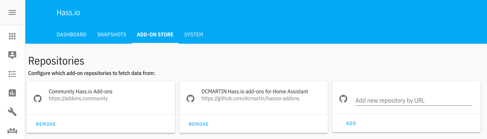

# `horizon.dcmartin.com`


This repository contains YAML files for the configuration of the [Home Assistant](http://home-assistant.io)  site at [`horizon.dcmartin.com`](http://horizon.dcmartin.com:3092) site; **unfortunately this site requires authentication**.  

This   site is a demonstration and proof-of-concept for a variety of [Open Horizon](http://github.com/open-horizon) _edge_ microservices.  The Open Horizon microservices are run as Docker containers on a distributed network across a wide range of computing devices; from [Power9](http://openpowerfoundation.org/) servers to RaspberryPi [Zero W](https://www.raspberrypi.org/products/raspberry-pi-zero-w/) micro-computers.

###What is the edge?
The edge of the network is where connectivity is lost and privacy is challenged; extending the services developed for the cloud to these scenarios requires additional considerations for microservices development, notably graceful degradation when services are lost, as well as automated recovery and restart when appropriate.

Available computing in edge scenarios may vary from a single device to multiple varying devices on a local-area-network (LAN), for example _home automation_.  Example use-cases include detecting motion and classifying entities seen and monitoring Internet connectivity.

<hr>

# A - What is Home Assistant
Open source home automation that puts local control and privacy first. Powered by a worldwide community of tinkerers and DIY enthusiasts. Perfect to run on a [Raspberry Pi](https://en.wikipedia.org/wiki/Raspberry_Pi) or a local server.   HomeAssistant include _addon_ Docker containers  from the HomeAssistant [community](https://github.com/hassio-addons/repository/blob/master/README.md).

## A.1 - Install Home Assistant

For details information on installing Home Assistant, please refer to the [documentation](https://www.home-assistant.io/hassio/installation/).

### Step 1
 Download and flash (e.g. using [Balena Etcher](https://www.balena.io/etcher/)) an appropriate operating system for the target device (e.g. [Raspbian Lite](https://www.raspberrypi.org/downloads/raspbian/) for RaspberryPi) and  _don't unmount or eject after flashing_.

Then specify the wireless and enable `ssh` access; for example, using the provided script `sh/add-wpa.sh`:

```
% NETWORK_SSID=WIFINAME NETWORK_PASSWORD=MyP@S$WoRd ./sh/add-wpa.sh
```
When completed, eject the SD card, insert into target device and power-on.

### Step 2
When the system has completed booting, it will automatically join the indicated wireless network.  To find the device on the network, search for it using the `nmap` program, for example:

```
% sudo nmap -sn -T5 192.168.1.0/24 | egrep -B2 -i raspberry
```
Select the results the new RaspberryPi device found:

```
Nmap scan report for 192.168.1.37
Host is up (0.0053s latency).
MAC Address: XX:XX:XX:XX:XX:XX (Raspberry Pi Foundation)
```

### Step 3
Copy your `ssh` credentials to the target device, for example:

```
% ssh-copy-id pi@192.168.1.37
```
and enter the default password `raspberry` -- resulting (hopefully) with indication of success:

```
/usr/bin/ssh-copy-id: INFO: Source of key(s) to be installed: "/Volumes/user/.ssh/id_rsa.pub"
/usr/bin/ssh-copy-id: INFO: attempting to log in with the new key(s), to filter out any that are already installed
/usr/bin/ssh-copy-id: INFO: 1 key(s) remain to be installed -- if you are prompted now it is to install the new keys
pi@192.168.1.37's password: 

Number of key(s) added:        1

Now try logging into the machine, with:   "ssh 'pi@192.168.1.37'"
and check to make sure that only the key(s) you wanted were added.
```

### Step 4
Access the target device using `ssh` and install pre-requisites for Home Assistant, including:

+ `software-properties-common`
+ `apparmor-utils`
+ `apt-transport-https`
+ `avahi-daemon`
+ `ca-certificates`
+ `curl`
+ `dbus`
+ `jq`
+ `socat`
+ `network-manager` _(optional)_

```
sudo apt update -qq -y
sudo apt upgrade -qq -y
sudo apt install -y software-properties-common apparmor-utils apt-transport-https avahi-daemon ca-certificates curl dbus jq socat network-manager
```

If `network-manager` is installed, disable the MAC address randomization; create the file:

```
/etc/NetworkManager/conf.d/100-disable-wifi-mac-randomization.conf
```

With the following content:

```
[connection]
wifi.mac-address-randomization=1
[device]
wifi.scan-rand-mac-address=no
```

### Step 5
Install [Docker](http://docker.com) using the script from `get.docker.com`:

```
curl -sL get.docker.com > getdocker.sh
chmod 755 getdocker.sh 
sudo ./getdocker.sh 
```

### Step 6
Download the installation script (`hassio_install.sh`) and save it, and enable execution; for example:

```
curl -sL "https://raw.githubusercontent.com/home-assistant/hassio-installer/master/hassio_install.sh" -o hassio_install.sh
chmod 755 hassio_install.sh
```

### Step 7
Install using the downloaded script; run script as root and provide a `MACHINE` option for non-x86 devices.  See the table below to help identify the proper machine.

Device|Architecture|MACHINE|comment
:-------|:-------:|-------|:-------
RaspberryPi3|ARM Cortex-A53 |`raspberrypi3`|
RaspberryPi4| ARM Cortex-A72|`raspberrypi4`|
nVidia Jetson Nano|ARM Cortex-A57|`qemuarm-64`|

**For example**:

```
sudo ./hassio_install.sh -m raspberrypi3
```

Resulting (hopefully) successfully, for example:

```
[Warning] No NetworkManager support on host.
[Info] Install supervisor Docker container
[Info] Install supervisor startup scripts
Created symlink /etc/systemd/system/multi-user.target.wants/hassio-supervisor.service → /etc/systemd/system/hassio-supervisor.service.
[Info] Install AppArmor scripts
Created symlink /etc/systemd/system/multi-user.target.wants/hassio-apparmor.service → /etc/systemd/system/hassio-apparmor.service.
[Info] Run Hass.io
```

The download and installation of the `hassio_supervisor` and `homeassistant` Docker containers may require up to twenty (20) minutes, depending on network connection and host performance.  The default configuration will setup on the localhost using port `8123`.

For more information refer to the [installation instructions](https://www.home-assistant.io/hassio/installation/#alternative-install-on-a-generic-linux-host).

### A.1.1 - `mqtt`
Set up [Mosquitto](https://mosquitto.org/) as MQTT [broker](https://www.home-assistant.io/addons/mosquitto/) known as `core-mosquitto` in Home Assistant.  For example:

```
{
  "logins": [
    {
      "username": "username",
      "password": "password"
    }
  ],
  "anonymous": false,
  "customize": {
    "active": false,
    "folder": "mosquitto"
  },
  "certfile": "fullchain.pem",
  "keyfile": "privkey.pem",
  "require_certificate": false
}
```

### A.1.2 - USB camera with VirtualBox _(optional)_
If using a VirtualBox Ubuntu LINUX environment a local camera, either built-in or USB attached, may be utilized.  In addition to configuring VirtualBox with its _extension pack_, the camera should be mapped into the VM through the VirtualBox **Ports** interface for USB devices.

Then install the extension pack into the LINUX environment:

```
sudo apt install virtualbox-ext-pack
```

### A.1.3 - Static IP _(optional)_
To use static IP addresses, change the `/etc/network/interfaces` file, for example to configure a RaspberryPi with both wired (`eth0`) and wireless (`wlan0`) networking (presuming host is also running `dnsmasq` addon):

```
auto lo
iface lo inet loopback

auto eth0
iface eth0 inet static
address 192.168.1.50
gateway 192.168.1.1
netmask 24

auto wlan0 
iface wlan0 inet static
address 192.168.1.51
gateway 192.168.1.1
netmask 24

dns-nameservers 192.168.1.50 1.1.1.1 9.9.9.9 8.8.8.8 8.8.4.4
```

## A.3 Site setup

### Step 1
To utilize additional capabilities in this repository there are some additional applications required:

```
sudo apt install -qq -y git make build-essential
```

### Step 2
Copy the contents of this repository into a temporary directory, e.g. `/tmp/config`:

```
git clone http://github.com/dcmartin/horizon.dcmartin.com /tmp/config
cd /tmp/config
```

### Step 3
Move the contents of the repository into the HomeAssistant configuration directory:

```
sudo mv .??* * /usr/share/hassio/homeassistant
sudo chown -R $(whoami) /usr/share/hassio/homeassistant
```


### Step 4
Create the `motion/webcams.json` file with details on the camera(s) attached.  Those details include:

+ `name` : a unique name for the camera (e.g. `kitchencam`)
+ `mjpeg_url` : location of "live" motion JPEG stream from camera
+ `device` : _(optional)_ specifies the local V4L2 device
+ `username` and `password` : credentials for access via the `mjpeg_url`
+ `icon` : specified (mostly) from the [Material Design Icons](https://materialdesignicons.com/) selection.

#### Local camera
For example for an attached camera on `/dev/video0` named `kitchencam` using the icon `stove`:

```
[
  {
    "name": "kitchencam",
    "device": "/dev/video0",
    "mjpeg_url": "http://127.0.0.1:8090/1",
    "still_image_url": "http://127.0.0.1:8090/1",
    "icon": "stove",
    "username": "username",
    "password": "password"
  }
]   
```

#### Network camera
For network cameras that provide motion JPEG streaming, the `url` provides direct access; the `mjpeg_url` may be either the same, or may utilize the local streaming port (n.b. `8090`) and camera (n.b. `/1`).

```
[
  {
    "name": "pondlive",
    "url": "http://192.168.1.174/img/video.mjpeg",
    "mjpeg_url": "http://127.0.0.1:8090/1",
    "still_image_url": "",
    "icon": "waves",
    "username": "!secret webcam-username",
    "password": "!secret webcam-password"
  }
]
```

#### FTP camera
For network cameras that deposit video via FTP to the local `ftp` addon, the configuration below indicates the `url` with `ftpd` specified as protocol; the `username` and `password` apply the the `mjpeg_url` for access to the camera (n.b. direct, not through the `motion` port).

```
[
  {
    "name": "backyard",
    "url": "ftpd:///share/ftp/backyard",
    "mjpeg_url": "http://192.168.1.183/img/video.mjpeg",
    "still_image_url": "http://192.168.1.183/img/snapshot.cgi",
    "icon": "texture-box",
    "username": "!secret webcam-username",
    "password": "!secret webcam-password"
  },
  ...
]
```

### Step 5
Build the configuration files using the `make` command:

```
cd /usr/share/hassio/homeassistant
```

Specify control variables appropriate for environment:

```
echo '$(domainname)' > DOMAIN_NAME
echo $(hostname -I | awk '{ print $1 }') > HOST_IPADDR
echo $(hostname -f) > HOST_NAME
echo 'whocares' > EXCHANGE_APIKEY
echo $(whoami) > EXCHANGE_ORG
echo 'username' > WEBCAM_USERNAME
echo 'password' > WEBCAM_PASSWORD
echo 'username' > MQTT_USERNAME
echo 'password' > MQTT_PASSWORD
```

### Step 6
Remove the default `configuration.yaml` and link (or copy) the template provided:

```
rm configuration.yaml
ln -s configuration.yaml.tmpl configuration.yaml
```

### Step 7
Build the YAML configuration files based on the environment and the `motion/webcams.json` file and restart the Home Assistant server:

```
make restart
```

The results include both `WARN` and `INFO` for environment specified:

```
++ WARN: LOGGER_DEFAULT unset; default: warn
++ WARN: AUTOMATION_internet unset; default: off
++ WARN: AUTOMATION_startup unset; default: off
++ WARN: AUTOMATION_sdr2msghub unset; default: off
++ WARN: AUTOMATION_yolo2msghub unset; default: off
-- INFO: DOMAIN_NAME: dcmartin.com
++ WARN: HOST_NAME unset; default: pi3-2
-- INFO: HOST_IPADDR: 192.168.1.72
-- INFO: HOST_PORT: 80
-- INFO: HOST_THEME: green
++ WARN: MQTT_HOST unset; default: core-mosquitto
++ WARN: MQTT_PORT unset; default: 1883
++ WARN: MQTT_USERNAME unset; default: username
++ WARN: MQTT_PASSWORD unset; default: password
++ WARN: WEBCAM_USERNAME unset; default: dcmartin
-- INFO: WEBCAM_PASSWORD: username
++ WARN: NETDATA_URL unset; default: http://192.168.1.72:19999/
++ WARN: DIGITS_URL unset; default: http://digits.dcmartin.com:5000/
++ WARN: COUCHDB_URL unset; default: http://couchdb.dcmartin.com:5984/_utils
++ WARN: EDGEX_URL unset; default: http://edgex.dcmartin.com:4000
++ WARN: CONSUL_URL unset; default: http://consul.dcmartin.com:8500/ui
++ WARN: EXCHANGE_URL unset; default: http://exchange.dcmartin.com:3090
++ WARN: EXCHANGE_ORG unset; default: dcmartin
++ WARN: EXCHANGE_ORG_ADMIN unset; default: dcmartin
-- INFO: EXCHANGE_APIKEY: whocares
++ WARN: HZNMONITOR_URL unset; default: http://hznmonitor.dcmartin.com:3094
++ WARN: GRAFANA_URL unset; default: http://grafana.dcmartin.com:3000
++ WARN: INFLUXDB_HOST unset; default: influxdb.dcmartin.com
-- INFO: INFLUXDB_PASSWORD: ask4it
making motion
make[1]: Entering directory '/usr/share/hassio/homeassistant/motion'
make[1]: Nothing to be done for 'default'.
make[1]: Leaving directory '/usr/share/hassio/homeassistant/motion'
making secrets.yaml
```


# A.2 - Home-Assistant _addons_
There are several community _addons_ which are useful in configuration, management, and functionality.  These include the following:

+ `mqtt` - provides a local MQTT broker; **required to use the `motion` addon**

These addons and many other are available from the **ADD-ON** store in Home Assistant.

Integration between Home Assistant and Open Horizon utilizes both the Home Assistant MQTT broker as well as several custom _addons_, available in another [repository](https://github.com/dcmartin/hassio-addons/blob/master/README.md), which may be installed using the **Hassio** control panel in the Home Assistant Web UI.

These addons are available by specifying the repository in the Hassio "ADD-ON STORE" section, for example adding the repository for this site: [`https://github.com/dcmartin/hassio-addons`](https://github.com/dcmartin/hassio-addons) will be displayed in the `ADD-ON STORE`:



And when successful the following should appear at the end of the page:


### A.2.1 - `motion`
The `motion` add-on processes video information into motion detection JSON events, multi-frame GIF animations, and one representative frame with entities detected, classified, and annotated (n.b. requires Open Horizon `yolo4motion` service).  This addon is designed to work with a variety of sources, including:

+ `3GP` - motion-detecting WebCams (e.g. Linksys WCV80n); received via the `FTP` community _addon_
+ `MJPEG` - network accessible cameras providing Motion-JPEG real-time feed
+ `V4L2` - video for LINUX (v2) for direct attach cameras, e.g. Sony Playstation3 Eye camera or RaspberryPi v2

Visit  [`motion`](https://github.com/dcmartin/hassio-addons/tree/master/motion) page for details. 

### A.2.2 - `yolo4motion`
Processes images from the `motion` addon received via MQTT through the [**YOLO**](https://pjreddie.com/darknet/yolo/) open source object detection and classification deep convolutional neural network (DCNN) and publishes results via MQTT.

Visit [`yolo4motion`](https://github.com/dcmartin/hassio-addons/tree/master/yolo4motion) page for details. 

### A.2.3 - `kafka2mqtt4yolo `
The Kafka to MQTT relay for YOLO addon is designed to consume Kafka messages on the topic `yolo2msghub` and produce MQTT messages for consumption by the Home Assistant MQTT broker _addon_.  Visit  [`kafka2mqtt4yolo`](https://github.com/dcmartin/hassio-addons/tree/master/kafka2mqtt4yolo) page for details. 

### A.2.4 - `cpu2msghub`
Collects Kafka messages on topic: `cpu2msghub` and produces MQTT messages for consumption by Home Assistant MQTT `sensor` on `cpu2msghub` topic as `events`.  Visit  [`cpu2msghub`](https://github.com/dcmartin/hassio-addons/tree/master/cpu2msghub) page for details. 

### A.2.5 - `sdr2msghub`
Collects Kafka messages on topic: `sdr/audio` and produces MQTT messages for consumption by Home Assistant MQTT `sensor` on `sdr2msghub` as `events`;  processes spoken audio through IBM Watson Speech-to-text (STT) and Natual Language Understanding (NLU) to produce sentiment and other AI predictions.  Visit  [`sdr2msghub`](https://github.com/dcmartin/hassio-addons/tree/master/sdr2msghub) page for details. 


### A.2.7 - `configurator`
Configure Home Assistant through an integrated Web user-interface; more instructions [here](https://www.home-assistant.io/addons/configurator)

### A.2.8 - `dnsmasq`
If you want to use the Home Assistant [DNS](https://www.home-assistant.io/addons/dnsmasq/) _addon_, the existing DNS resolver for Ubuntu must be disabled.  This method works on Ubuntu Releases 17.04 (Zasty), 17.10 (Artful), 18.04 (Bionic) and 18.10 (Cosmic):

Disable and stop the systemd-resolved service:

```
sudo systemctl disable systemd-resolved.service
sudo systemctl stop systemd-resolved
```

Set DNS to `default`

```
sudo echo 'dns=default' >> /etc/NetworkManager/NetworkManager.conf
```

Delete  /etc/resolv.conf

```
sudo rm /etc/resolv.conf
```

Restart network-manager

```
sudo service network-manager restart
```
<hr>

# B - What is Open Horizon
Open Horizon is an open source project sponsored by IBM to provide an orchestration mechanism for Docker containers in edge scenarios.  Containers are composed into _services_ which are subsequently packaged into _patterns_ that can be deployed to _nodes_ connected to the _exchange_.  The patterns run by nodes are combinations of services that are designed to interoperate.

## B.1 -  Install Open Horizon
Installation instructions can be found [here](https://github.com/dcmartin/open-horizon/blob/master/setup/README.md).

### `exchange-api`
Once installation is complete, the _services_ and _patterns_ can be built and _published_ using the Open Horizon [`exchange-api`](https://github.com/open-horizon/exchange-api/blob/master/README.md) to an _exchange_ -- a server running a specified set of Docker containers, e.g. `http://alpha.edge-fabric.com/v1/`.  Those containers include both  PostgreSQL and MongoDB databases.

### `edge-sync-service`
The [`edge-sync-service`](https://github.com/open-horizon/edge-sync-service/blob/master/README.md) provides for bi-directional synchonization of binary objects between the server and the devices using the _node_ information in the _exchange_.  The client component is called the `ESS` and the service component is called the `CSS`.  Client and server poll for new objects and data; object data consumers indicate receipt.  A sample service, `esstest`, is available in another [repository](https://github.com/dcmartin/open-horizon/blob/master/esstest/README.md).

### `anax`
The [`anax`](https://github.com/open-horizon/anax/blob/master/README.md) control application runs on both the client and the server (n.b. as an _agbot_); the client version is installed on a supported device, for example the Raspberry Pi Model 3B+ (n.b. [instructions](https://github.com/dcmartin/open-horizon/blob/master/doc/RPI.md)), and then attempts to reach an _agreement_ with an _agbot_ on the server for the client's requested _pattern_ (e.g. [`yolo2mshubg`](https://github.com/dcmartin/open-horizon/blob/master/yolo2msghub/README.md).

## B.2 - Use Open Horizon
After client software installation, the device may be _registered_ to run a specific _pattern_ of services from the exchange.  The pattern specifies one or more services to be deployed to the device and registration records the device as a _node_ in the exchange requesting that pattern of services.

### Example: `yolo2msghub`
The [`yolo2msghub`](https://github.com/dcmartin/open-horizon/blob/master/yolo2msghub/README.md) [_service_](https://github.com/dcmartin/open-horizon/blob/master/yolo2msghub/service.json) is also defined as a [_pattern_](https://github.com/dcmartin/open-horizon/blob/master/yolo2msghub/pattern.json).  The _service_ is composed of one Docker container deployed as `yolo2msghub`, and four (4) dependencies on `requiredServices`:

+ [`yolo`](https://github.com/dcmartin/open-horizon/blob/master/yolo/README.md) - Provide [YOLO]() image classification service
+ [`wan`](https://github.com/dcmartin/open-horizon/blob/master/wan/README.md) - Test Internet connectivity
+ [`hal`](https://github.com/dcmartin/open-horizon/blob/master/hal/README.md) - Inventory device attributes
+ [`cpu`](https://github.com/dcmartin/open-horizon/blob/master/cpu/README.md) - Calculate CPU utilization percent

Together these five (5) services provide an automated mechanism to capture pictures from a local camera, detect entities of interest (e.g. `person`), and report on presence using the Kafka messaging platform (aka _message hub_).  A sample screen capture (with development mode `on`) is below.


## B.3 - `dcmartin` _pattern_ templates
A set of Open Horizon _services_ and _patterns_ is available in another [repository](http://github.com/dcmartin/open-horizon).  Some of the patterns are specified to interoperate with the Home Assistant _addons_, notably the **MQTT broker**, to process messages between services.

### B.3.1 - `motion`
Provides a combination of multiple services for deployment target devices, including RaspberryPi and Jetson Nano.  The primary services in this pattern are:

+ `motion2mqtt` - process video from LINUX (V4L2), direct-attach, cameras; pub/sub MQTT topic: multiple
+ `yolo4motion` - process image using `yolo`; pub/sub MQTT topics to/from `motion` _addon_

### B.3.2 - `startup` 
The primary services in this pattern are:

+ `startup` - device, Docker, and node status; produce JSON on port: 3093; Kafka topic: `startup`

### B.3.3 - `hznsetup` 
The primary services in this pattern are:

+ `hznsetup` - automate setup of new devices as _nodes_; also available as _pattern_ with `hznmonitor`
+ `hznmonitor` - process JSON `startup` messages via Kafka; summarize JSON; publish MQTT topic: `startup`

## B.4 - `dcmartin` _services_
A set of Open Horizon _services_ and _patterns_ is available in another [repository](http://github.com/dcmartin/open-horizon).  Some of the patterns are specified to interoperate with the Home Assistant _addons_, notably the **MQTT broker**, to process messages between services.

### B.4.1 -  `motion2mqtt`
Using the open source [`motion`](https://motion-project.github.io/) package, process camera output and produce motion detection _events_ indicating the start (optional) and end of motion.  **Notice**: there are a wide variety of options to the `motion` package; not all are necessarily supported or exploited in this service.  
Visit  [`motion2mqtt`](https://github.com/dcmartin/open-horizon/blob/master/motion2mqtt/README.md) page for details. 

### B.4.2 - `yolo4motion`
Visit  [`yolo4motion`](https://github.com/dcmartin/open-horizon/blob/master/yolo4motion/README.md) page for details. 

### B.4.3 -  `mqtt`
Visit  [`yolo4motion`](https://github.com/dcmartin/open-horizon/blob/master/mqtt/README.md) page for details. 

### B.4.4 - `mqtt2mqtt`
Visit  [`yolo4motion`](https://github.com/dcmartin/open-horizon/blob/master/mqtt2mqtt/README.md) page for details. 

### B.4.5 - `startup`
Visit  [`startup`](https://github.com/dcmartin/open-horizon/blob/master/startup/README.md) page for details. 

### B.4.6 - `hznsetup`
Visit  [`hznsetup`](https://github.com/dcmartin/open-horizon/blob/master/hznsetup/README.md) page for details. 

### B.4.7 - `hznmonitor`
Visit  [`hznmonitor`](https://github.com/dcmartin/open-horizon/blob/master/hznmonitor/README.md) page for details. 

### B.4.8 - `sdr2msghub`
Visit  [`sdr2msghub`](https://github.com/dcmartin/open-horizon/blob/master/sdr2msghub/README.md) page for details. 

### B.4.9 - `yolo2msghub`
Visit  [`yolo2msghub`](https://github.com/dcmartin/open-horizon/blob/master/yolo2msghub/README.md) page for details. 

# Changelog & Releases

Releases are based on [Semantic Versioning][semver], and use the format
of ``MAJOR.MINOR.PATCH``. In a nutshell, the version will be incremented
based on the following:

- ``MAJOR``: Incompatible or major changes.
- ``MINOR``: Backwards-compatible new features and enhancements.
- ``PATCH``: Backwards-compatible bugfixes and package updates.
[semver]: https://semver.org/


## Authors & contributors

[David C Martin][dcmartin] (github@dcmartin.com)

[userinput]: ../yolo2msghub/userinput.json
[service-json]: ../yolo2msghub/service.json
[build-json]: ../yolo2msghub/build.json
[dockerfile]: ../yolo2msghub/Dockerfile
[dcmartin]: https://github.com/dcmartin
[edge-fabric]: https://console.test.cloud.ibm.com/docs/services/edge-fabric/getting-started.html
[edge-install]: https://console.test.cloud.ibm.com/docs/services/edge-fabric/adding-devices.html
[edge-slack]: https://ibm-appsci.slack.com/messages/edge-fabric-users/
[ibm-apikeys]: https://console.bluemix.net/iam/#/apikeys
[ibm-registration]: https://console.bluemix.net/registration/
[issue]: https://github.com/dcmartin/open-horizon/issues
[macos-install]: http://pkg.bluehorizon.network/macos
[open-horizon]: http://github.com/open-horizon/
[repository]: https://github.com/dcmartin/open-horizon
[setup]: ../setup/README.md


[amd64-layers-shield]: https://images.microbadger.com/badges/image/dcmartin/plex-amd64.svg
[amd64-microbadger]: https://microbadger.com/images/dcmartin/plex-amd64
[armhf-microbadger]: https://microbadger.com/images/dcmartin/plex-armhf
[armhf-layers-shield]: https://images.microbadger.com/badges/image/dcmartin/plex-armhf.svg

[amd64-version-shield]: https://images.microbadger.com/badges/version/dcmartin/plex-amd64.svg
[amd64-arch-shield]: https://img.shields.io/badge/architecture-amd64-blue.svg
[amd64-dockerhub]: https://hub.docker.com/r/dcmartin/plex-amd64
[amd64-pulls-shield]: https://img.shields.io/docker/pulls/dcmartin/plex-amd64.svg
[armhf-arch-shield]: https://img.shields.io/badge/architecture-armhf-blue.svg
[armhf-dockerhub]: https://hub.docker.com/r/dcmartin/plex-armhf
[armhf-pulls-shield]: https://img.shields.io/docker/pulls/dcmartin/plex-armhf.svg
[armhf-version-shield]: https://images.microbadger.com/badges/version/dcmartin/plex-armhf.svg
[i386-arch-shield]: https://img.shields.io/badge/architecture-i386-blue.svg
[i386-dockerhub]: https://hub.docker.com/r/dcmartin/plex-i386
[i386-layers-shield]: https://images.microbadger.com/badges/image/dcmartin/plex-i386.svg
[i386-microbadger]: https://microbadger.com/images/dcmartin/plex-i386
[i386-pulls-shield]: https://img.shields.io/docker/pulls/dcmartin/plex-i386.svg
[i386-version-shield]: https://images.microbadger.com/badges/version/dcmartin/plex-i386.svg
