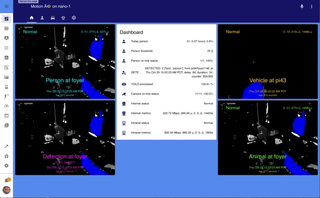

#  Motion &Atilde;&#128065;
An open-source software solution for situational awareness from a network of video and audio sources.  Utilizing [Home Assistant](http://home-assistant.io), [addons](http://github.com/motion-ai/addons), the LINUX Foundation [Open Horizon](http://github.com/open-horizon) edge fabric, and [edge AI services](https://github.com/motion-ai/open-horizon), the system enables _personal_ AI on low-cost devices; integrating object detection and classification into a dashboard of daily activity.

+ Watch the [overview](https://youtu.be/elhkldImJ7c) video, [introduction](https://youtu.be/9dW5mtVOzYo) and [installation](https://youtu.be/BWJdDWKUXyE)
+ Use the QuickStart (see below) on RaspberryPi4, Jetson Nano, or Intel/AMD host; see [guide](docs/QUICKSTART.md).
+ Visit us on the [Web](http://www.motion-ai.com)
+ Find us on [Facebook](https://www.facebook.com/groups/motionai/)
+ Connect with us on [LinkedIn](https://www.linkedin.com/company/motion-%C3%A3i)
+ Message us on [Slack](https://join.slack.com/t/motionai/shared_invite/zt-iwiwp63m-tAKNanRHHQfS~6dVfxgL4Q)

## Status


[arm64-shield]: https://img.shields.io/badge/arm64-yes-green.svg
[amd64-shield]: https://img.shields.io/badge/amd64-yes-green.svg
[arm-shield]: https://img.shields.io/badge/arm-yes-green.svg

![Supports arm64 Architecture][arm64-shield]
![Supports arm Architecture][arm-shield]
![Supports amd64 Architecture][amd64-shield]


## Example


## Quick Start
Start-to-finish takes about thirty (30) minutes with a broadband connection.  There are [options](docs/OPTIONS.md) to consider; a non-executable example script may be utilized to specify commonly used options.  **Please edit the example [script](config.sh) for your environment**.

The following two (2) sets of commands will install `motion-ai` on the following types of hardware:

+ RaspberryPi Model 3B+ or 4 (`arm`); 2GB recommended
+ Ubuntu18.04 or Debian10 VM (`amd64`); 2GB, 2vCPU recommended
+ nVidia Jetson Nano (`arm64`|`aarch64`); 4GB required

The initial configuration presumes a locally attached camera on `/dev/video0`.  Reboot the system after completion; for example:


```
sudo apt update -qq -y
sudo apt install -qq -y make git curl jq apt-utils ssh apparmor grub2-common network-manager
sudo touch /etc/default/grub
sudo mkdir /usr/share/hassio
sudo chmod 775 /usr/share/hassio
cd /usr/share/hassio
git clone http://github.com/dcmartin/motion-ai .
make
```

To install [Home Assistant](http://home-assistant.io) you will need both an *architecture dependent* _OS Agent_ as well as the _Supervised Home Assistant_ package; for example for <code>ARM64</code>:

```
wget https://github.com/home-assistant/os-agent/releases/download/1.2.2/os-agent_1.2.2_linux_aarch64.deb
sudo dpkg -i os-agent_1.2.2_linux_aarch64.deb
```
Then download and install the <code>Supervised Home Assistant</code>:

```
wget https://github.com/home-assistant/supervised-installer/releases/latest/download/homeassistant-supervised.deb
sudo dpkg --ignore-depends=docker-ce -i homeassistant-supervised.deb
```

### Post Quickstart

When the system reboots install the official MQTT broker (aka `core-mosquitto`) and Motion Classic (aka `motion-video0`) _add-ons_ using the Home Assistant Add-on Store (n.b. Motion Classic add-on may be accessed by adding the repository [http://github.com/motion-ai/addons](http://github.com/motion-ai/addons) to the Add-On Store.

Select, install, configure and start each add-on (see below).  When both add-ons are running, return to the command-line and start the AI's.  After the MQTT and Motion Classic addons have started, run the `make restart` command to synchroize the Home Assistant configuration with the Motion Classic add-on, for example:

```
cd ~/motion-ai
make restart
```
<hr>

# User Experience

## Dashboard
Once the system has started it will display a default view; note the image below is of a configured system:


Historical information, current status, and a device map of activity are also provided in the default dashboard.


## Administrators
A more detailed interface is provided to administrators _only_, and includes both summary and detailed views for the system, including access to [**NetData**](docs/netdata.png)  and the [**motion add-on**](docs/motion-ui.png) Web interface.


Administrators have access to all panels and dashboards, including the _selected_, _overview_ (aka **experimental**), and per camera (see below).  Notifications can be specified for both individual cameras as well as for all cameras.


## Notifications & Alerts
Notifications appear in the side panel; alerts are sent to smartphone and smart-speakers when enabled and configured.


<br>


# Add-on's
Install the [MQTT](https://github.com/home-assistant/hassio-addons/blob/master/mosquitto/README.md) and [Motion Classic](https://github.com/motion-ai/addons/blob/master/motion-video0/README.md) _add-ons_ from the **Add-On Store** and configure and start; add the repository [https://github.com/motion-ai/addons](https://github.com/motion-ai/addons) to the Add-On Store to install Motion Classic.

The Motion Classic configuration includes many options, most which typically do not need to be changed. The `group` is provided to segment a network of devices (e.g. _indoor_ vs. _outdoor_); the `device` determines the MQTT identifier for publishing; the `client` determines the MQTT identifier for subscribing; `timezone` should be local to installation.

**Note:** No capital letters [A-Z], spaces, hyphens (-), or other special characters may be utilized for any of the following identifiers:

+ `group` - The collection of devices
+ `device` - The identifier for the hardware device
+ `name` - The name of the camera

The `cameras` section is a listing (n.b. hence the `-`) and provide information for both the motion detection as well as the front-end Web interface.  The `name`,`type`, and `w3w` attributes are **required**.  The `top`, `left`, and `icon` attributes are _optional_ and are used to locate the camera on the overview image.  The `width`, `height`, and other attributes are _optional_ and are used for motion detection.


#### Example configuration (_subset_)  
```
...
group: motion
device: raspberrypi
client: raspberrypi
timezone: America/Los_Angeles
cameras:
  - name: local
    type: local
    w3w: []
    top: 50
    left: 50
    icon: webcam
    width: 640
    height: 480
    framerate: 10
    minimum_motion_frames: 30
    event_gap: 60
    threshold: 1000
  - name: network
    type: netcam
    w3w:
      - what
      - three
      - words
    icon: door
    netcam_url: 'rtsp://192.168.1.224/live'
    netcam_userpass: 'username:password'
    width: 640
    height: 360
    framerate: 5
    event_gap: 30
    threshold_percent: 2
```

## **AI**'s
Return to the command-line, change to the installation directory, and run the following commands to start the AI's; for example:

```
cd ~/motion-ai
./sh/yolo4motion.sh
./sh/face4motion.sh
./sh/alpr4motion.sh
```

These commands only need to be run once; the AI's will automatically restart whenever the system is rebooted.

## Overview image
The _overview_ image is used to display the location of camera icons specified in the _add-on_ (n.b. `top` and `left` percentages).  The _mode_ may be `local`, indicating that a local image file should be utilized; the default is `overview.jpg` in the `www/images/` directory.  The other modes utilize the Google Maps API; they are:

+ `hybrid`
+ `roadmap`
+ `satellite`
+ `terrain`

The _zoom_ value scales the images generated by Google Maps API; it does not apply to `local` images.


# Composition
The `motion-ai` solution is composed of two primary components:

+ [Home Assistant](http://home-assistant.io) - open-source home automation system
+ [Open Horizon](http://github.com/open-horizon) - [edge AI](http://github.com/dcmartin/open-horizon)  platform

Home Assistant _add-ons_:

+ [`motion`](https://github.com/motion-ai/addons/blob/master/motion-video0/README.md) - _add-on_ for Home Assistant - captures images and video of motion (n.b. [motion-project.github.io](http://motion-project.github.io))
+ [`MQTT`](https://github.com/home-assistant/hassio-addons/blob/master/mosquitto/README.md) - messaging broker 
+ [`FTP`](https://github.com/hassio-addons/addon-ftp/blob/master/README.md) - optional, only required for `ftpd` type cameras

Open Horizon AI _services_:

+ `yolo4motion` - [object detection and classification](https://github.com/dcmartin/open-horizon/tree/master/services/yolo4motion) 
+ `face4motion` - [face detection](https://github.com/dcmartin/open-horizon/tree/master/services/face4motion) 
+ `alpr4motion` - [license plate detection and classification](https://github.com/dcmartin/open-horizon/tree/master/services/alpr4motion) 

Data may be saved locally and processed to produce historical graphs as well as exported for analysis using other tools (e.g. time-series database _InfluxDB_ and analysis front-end _Grafana_).  Data may also be processed using _Jupyter_ notebooks.

## Supported architectures include:

[aarch64-shield]: https://img.shields.io/badge/aarch64-yes-green.svg
[amd64-shield]: https://img.shields.io/badge/amd64-yes-green.svg
[armv7-shield]: https://img.shields.io/badge/armv7-yes-green.svg
[tegra-shield]: https://img.shields.io/badge/tegra-yes-green.svg
[cuda-shield]: https://img.shields.io/badge/cuda-yes-green.svg
[coral-shield]: https://img.shields.io/badge/coral-beta-yellow.svg
[ncs2-shield]: https://img.shields.io/badge/ncs2-alpha-orange.svg

**CPU only**

+ ![Supports amd64 Architecture][amd64-shield] - `amd64` - Intel/AMD 64-bit virtual machines and devices
+ ![Supports aarch64 Architecture][aarch64-shield] - `aarch64` - ARMv8 64-bit devices 
+ ![Supports armv7 Architecture][armv7-shield] - `armv7` - ARMv7 32-bit devices (e.g. RaspberryPi 3/4)

**GPU accelerated**

+ ![Supports tegra Architecture][tegra-shield] -`aarch64` -  with nVidia GPU
+ ![Supports cuda Architecture][cuda-shield] - `amd64` - with nVida GPU
+ ![Supports coral Architecture][coral-shield] - `armv7`- with Google Coral Tensor Processing Unit
+ ![Supports ncs2 Architecture][ncs2-shield] -`armv7`- with Intel/Movidius  Neural Compute Stick v2

# Installation
Installation is performed in five (5) steps; see [detailed instructions](docs/INSTALL.md).  The software has been tested on the following devices:

+ RaspberryPi Model 3B+ and Model 4 (2 GB); Debian Buster
+ nVidia Jetson Nano and TX2; Ubuntu 18.04
+ VirtualBox VM; Ubuntu 18.04
+ Generic AMD64 w/ nVidia GPU; Ubuntu 18.04

## Accelerated hardware 1: nVidia Jetson Nano (aka `tegra`)
Recommended components:

1. [nVidia Jetson Nano developer kit; 4GB required](https://www.amazon.com/NVIDIA-Jetson-Nano-Developer-945-13450-0000-100/dp/B084DSDDLT/)
1. [4+ amp power-supply](https://www.adafruit.com/product/1466) or [another option](https://www.sparkfun.com/products/14932)
2. [High-endurance micro-SD card; _minimum_: 64 Gbyte](https://www.amazon.com/gp/product/B07P3D6Y5B)
3. One (1) jumper or [female-female wire for enabling power-supply](https://www.amazon.com/EDGELEC-Breadboard-Optional-Assorted-Multicolored/dp/B07GD2BWPY)
4. [Fan; 40x20mm; cool heat-sink](https://www.amazon.com/gp/product/B071W93333)
5. [SSD disk; optional; recommended: 250+ Gbyte](https://www.amazon.com/Samsung-250GB-Internal-MZ-76E250B-AM/dp/B07864WMK8)
6. [USB3/SATA cable and/or enclosure](https://www.amazon.com/gp/product/B07F7WDZGT)


## Accelerated hardware 2: RaspberryPi 4 with Intel NCS2  (aka `ncs2`)
This configuration includes dual OLED displays to provide display of annotations text and image, as well as a USB-attached camera (n.b. Playstation3 PS/Eye camera).  The Intel/NCS2 implemtation is still in _alpha_ mode and not in the `master` branch.


<hr>
# What  is _edge AI_?
The edge of the network is where connectivity is lost and privacy is challenged.

Low-cost computing (e.g. RaspberryPi, nVidia Jetson Nano, Intel NUC) as well as hardware accelerators (e.g. Google Coral TPU, Intel Movidius Neural Compute Stick v2) provide the opportunity to utilize artificial intelligence in the privacy and safety of a home or business.

To provide for multiple operational scenarios and use-cases (e.g. the elder's _activities of daily living_ (ADL)), the platform is relatively agnostic toward AI models or hardware and more dependent on system availability for development and testing.

An AI's **prediction quality** is dependent on the  _variety_, _volume_, and _veracity_ of the training data (n.b. see [_Understanding AI_](https://www.linkedin.com/pulse/understanding-ai-david-c-martin/), as the underlying deep, convolutional, neural-networks -- and other algorithms -- must be trained using information that represents the scenario, use-case, and environment; better predictions come from better information.

The Motion &Atilde;&#128065; system provides a _personal AI_ incorporating both a wide variety artificial intelligence, machine learning, and statistical models as well as a closed-loop learning cycle (n.b. see [_Building a Better Bot_](https://www.linkedin.com/pulse/building-better-bot-david-c-martin/)); increasing the volume, variety, and veracity of the corpus of knowledge.

# Example: [Age@Home](http://www.age-at-home.com)
This system may be used to build solutions for various operational scenarios (e.g. monitoring the elderly to determine patterns of daily activity and alert care-givers and loved ones when aberrations occur); see the [Age-At-Home](http://www.age-at-home.com/) project for more information; example below:


<hr>

# Changelog & Releases

Releases are based on Semantic Versioning, and use the format
of ``MAJOR.MINOR.PATCH``. In a nutshell, the version will be incremented
based on the following:

- ``MAJOR``: Incompatible or major changes.
- ``MINOR``: Backwards-compatible new features and enhancements.
- ``PATCH``: Backwards-compatible bugfixes and package updates.

## Author

David C Martin (github@dcmartin.com)

<a href="https://www.buymeacoffee.com/dcmartin" target="_blank"></a>

## Contribute:

+ Let everyone know about this project
+ Test a `netcam` or `local` camera and let me know

Add `motion-ai` as upstream to your repository:

```
git remote add upstream http://github.com/dcmartin/motion-ai.git
```

Please make sure you keep your fork up to date by regularly pulling from upstream. 

```
git fetch upstream
git merge upstream/master
```

## Stargazers
[](https://starchart.cc/dcmartin/motion)

## `CLOC`

See [CLOC.md](CLOC.md)


## License
[](https://app.fossa.com/projects/git%2Bgithub.com%2Fdcmartin%2Fmotion-ai?ref=badge_large)
