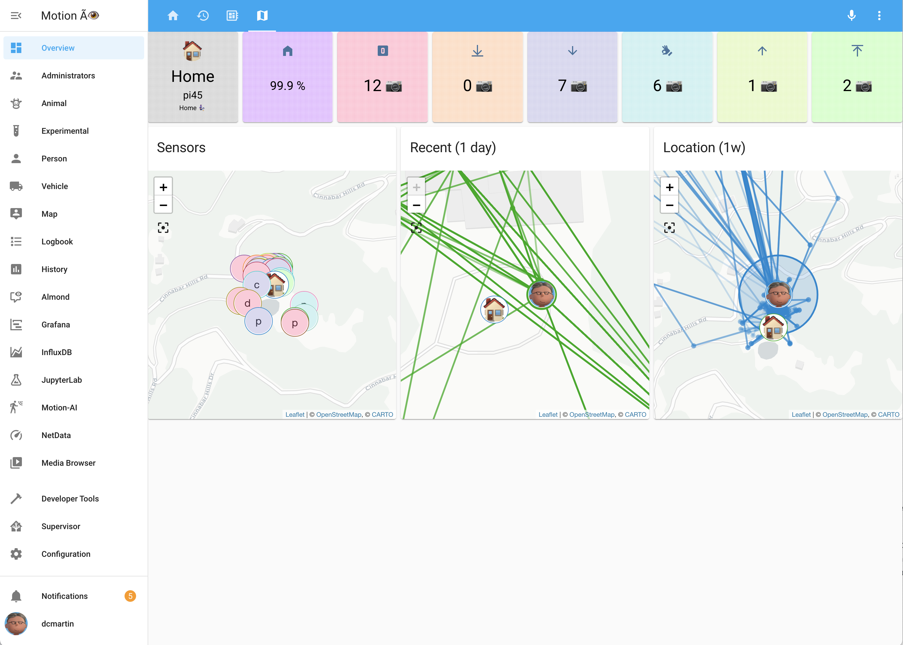

# Agent for Home Assistant OS

This is the OS Agent for Home Assistant. It is used for Home Assistant
OS and Home Assistant Supervised installation types and it allows the
Home Assistant Supervisor to communicate with the host operating system.

## Installation & Update

### Using the Home Assistant Operating System

The OS Agent is pre-installed with the Home Assistant Operating System.

Updates are part of the Home Assistant Operating System updates, which
the Home Assistant UI will offer to upgrade to when there is a new version
available.

### Using Home Assistant Supervised on Debian

Download the latest Debian package from OS Agent GitHub release page at:

<https://github.com/home-assistant/os-agent/releases/latest>

Next, install (or update) the downloaded Debian package using:

```shell
sudo dpkg -i os-agent_1.0.0_linux_x86_64.deb
```

## Dashboard
Once the system has rebooted it will display a default view; note the image below is of a configured system:


Historial information, current status, and a device map of activity are also provided in the default dashboard.




## Administrators
A more detailed interface is provided to administrators _only_, and includes both summary and detailed views for the system, including access to [**NetData**](docs/netdata.png)  and the [**motion add-on**](docs/motion-ui.png) Web interface.


Administrators have access to all panels and dashboards, including the _selected_, _overview_ (aka **experimental**), and per camera (see below).  Notifications can be specified for both individual cameras as well as for all cameras.


## Notifications & Alerts
Notifications appear in the side panel; alerts are sent to smartphone and smart-speakers when enabled and configured.


<br>


You can test if the installation was successful by running:

```bash
gdbus introspect --system --dest io.hass.os --object-path /io/hass/os
```

## Development

### Compile

```shell
go build -ldflags "-X main.version="
```

### Tests

```shell
gdbus introspect --system --dest io.hass.os --object-path /io/hass/os
```
git fetch upstream
git merge upstream/master
```

## Stargazers
[](https://starchart.cc/dcmartin/motion)

## `CLOC`

Language|files|blank|comment|code
:-------|-------:|-------:|-------:|-------:
YAML|449|2982|3363|50817
JSON|42|2|0|23767
Python|32|1175|796|7324
Bourne Shell|57|571|296|2842
Markdown|13|450|0|1536
make|3|184|81|1243
Jupyter Notebook|1|0|1020|927
HTML|1|19|1|89
XML|1|1|0|89
--------|--------|--------|--------|--------
SUM:|599|5384|5557|88634


## License
[](https://app.fossa.com/projects/git%2Bgithub.com%2Fdcmartin%2Fmotion-ai?ref=badge_large)
