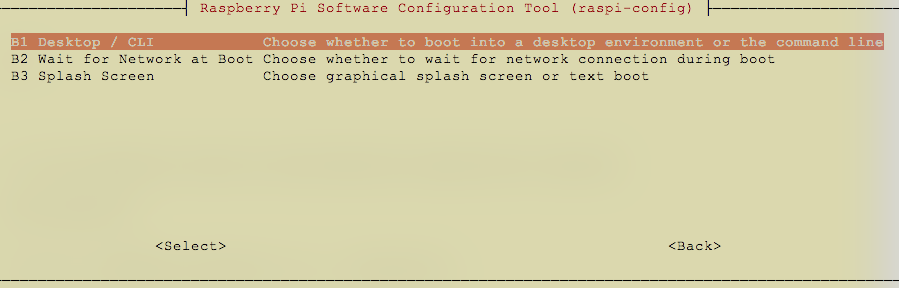
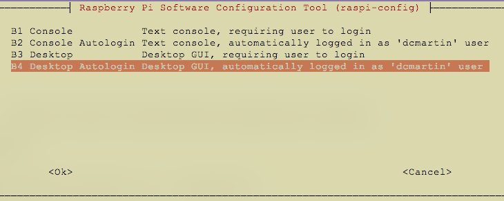

# `DEBIAN.md`
This document has additional information for configuration Debian-based LINUX operating systems, including Raspbian and Ubuntu.  

## Static IP _(optional)_
To use static IP addresses, change the `/etc/network/interfaces` file, for example to configure a system with both wired (`eth0`) and wireless (`wlan0`) networking (presuming host is also running `dnsmasq` addon):

```
auto lo
iface lo inet loopback

auto eth0
iface eth0 inet static
address 192.168.1.50
gateway 192.168.1.1
netmask 24

auto wlan0 
iface wlan0 inet static
address 192.168.1.51
gateway 192.168.1.1
netmask 24

dns-nameservers 192.168.1.50 1.1.1.1 9.9.9.9 8.8.8.8 8.8.4.4
```

## Increase swap  (_Raspbian_)
To accomodate running Home Assistant and its components in addition to the `motion` and `YOLO` software, the size of the swap file should be increased.  It is recommended to increase from the default 100 Mbytes; recommended size is 256.

```
sudo systemctl stop docker
sudo dphys-swapfile swapoff
SWAPSIZE=256
sudo sed -i "s/CONF_SWAPSIZE=.*/CONF_SWAPSIZE=${SWAPSIZE}/" /etc/dphys-swapfile
sudo dphys-swapfile swapon
sudo systemctl start docker
```

## Automatic desktop login (_Raspbian_)
If using a RaspberryPi with a connected display the device may be configured to automatically log into the device and start the graphical user interface (GUI).

The first step is installing the desktop manager:

```
sudo apt install -qq -y lightdm
```

Second step is to run the `raspi-config` program from the command-line and configure the system to boot to desktop GUI:

```
sudo raspi-config
```

Navigate through the screens; first selecting option `3. Boot Options`:


Then option `B1 Desktop / CLI`:



Finally, select option `B4 Desktop Autologin Desktop GUI` with the utilized account (e.g. `dcmartin`):



Select `<OK>` and exit the `rasp-config` application.  Then reboot the computer:

```
sudo reboot
```