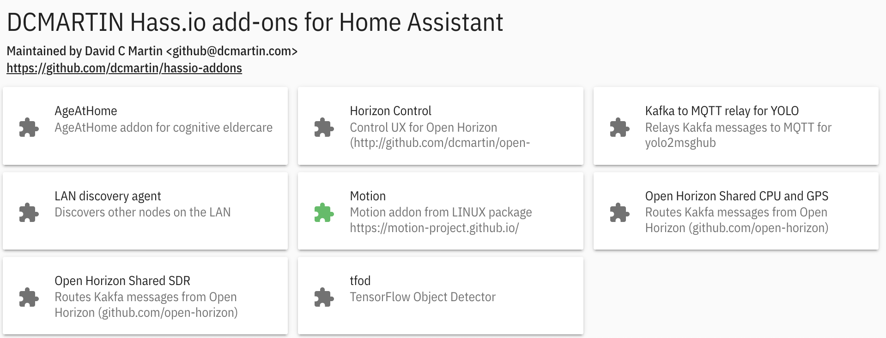

# `ADDONS.md`
There are several community _addons_ which are useful in configuration, management, and functionality.  These addons and many other are available from the **ADD-ON** store in Home Assistant.    Integration between Home Assistant and Open Horizon utilizes both the Home Assistant MQTT broker as well as several custom _addons_, available in another [repository](https://github.com/dcmartin/hassio-addons/blob/master/README.md), which may be installed using the **Hassio** control panel in the Home Assistant Web UI.

# Addon Store
These addons are available by specifying the repository in the Hassio "ADD-ON STORE" section, for example adding the repository for this site: [`https://github.com/dcmartin/hassio-addons`](https://github.com/dcmartin/hassio-addons) will be displayed in the `ADD-ON STORE`:


And when successful the following should appear at the end of the page:



## `motion`
The `motion` add-on processes video information into motion detection JSON events, multi-frame GIF animations, and one representative frame with entities detected, classified, and annotated (n.b. requires Open Horizon `yolo4motion` service).  This addon is designed to work with a variety of sources, including:

+ `3GP` - motion-detecting WebCams (e.g. Linksys WCV80n); received via the `FTP` community _addon_
+ `MJPEG` - network accessible cameras providing Motion-JPEG real-time feed
+ `V4L2` - video for LINUX (v2) for direct attach cameras, e.g. Sony Playstation3 Eye camera or RaspberryPi v2

Visit  [`motion`](https://github.com/dcmartin/hassio-addons/tree/master/motion) page for details. 

### EXAMPLE

```
log_level: info
log_motion_level: info
log_motion_type: ALL
default:
  changes: 'on'
  event_gap: 30
  framerate: 5
  minimum_motion_frames: 25
  post_pictures: best
  text_scale: 2
  threshold_percent: 2
  username: '!secret motioncam-username'
  password: '!secret motioncam-password'
  netcam_userpass: '!secret netcam-userpass'
  width: 640
  height: 480
mqtt:
  host: '!secret mqtt-broker'
  port: '!secret mqtt-port'
  username: '!secret mqtt-username'
  password: '!secret mqtt-password'
group: motion
device: pi42
client: pi42
timezone: America/Los_Angeles
cameras:
  - name: dogshed
    type: netcam
    netcam_url: 'rtsp://192.168.1.221/live'
  - name: sheshed
    type: netcam
    netcam_url: 'rtsp://192.168.1.223/live'
```

## `yolo4motion`
Processes images from the `motion` addon received via MQTT through the [**YOLO**](https://pjreddie.com/darknet/yolo/) open source object detection and classification deep convolutional neural network (DCNN) and publishes results via MQTT.

Visit [`yolo4motion`](https://github.com/dcmartin/hassio-addons/tree/master/yolo4motion) page for details. 

## `kafka2mqtt4yolo `
The Kafka to MQTT relay for YOLO addon is designed to consume Kafka messages on the topic `yolo2msghub` and produce MQTT messages for consumption by the Home Assistant MQTT broker _addon_.  Visit  [`kafka2mqtt4yolo`](https://github.com/dcmartin/hassio-addons/tree/master/kafka2mqtt4yolo) page for details. 

## `cpu2msghub`
Collects Kafka messages on topic: `cpu2msghub` and produces MQTT messages for consumption by Home Assistant MQTT `sensor` on `cpu2msghub` topic as `events`.  Visit  [`cpu2msghub`](https://github.com/dcmartin/hassio-addons/tree/master/cpu2msghub) page for details. 

## `sdr2msghub`
Collects Kafka messages on topic: `sdr/audio` and produces MQTT messages for consumption by Home Assistant MQTT `sensor` on `sdr2msghub` as `events`;  processes spoken audio through IBM Watson Speech-to-text (STT) and Natual Language Understanding (NLU) to produce sentiment and other AI predictions.  Visit  [`sdr2msghub`](https://github.com/dcmartin/hassio-addons/tree/master/sdr2msghub) page for details. 

# Community Addons

## `Mosquitto`
Provides a local MQTT broker; an MQTT broker is **_required_** to use the `motion` addon

## `Configurator`
Configure Home Assistant through an integrated Web user-interface; more instructions [here](https://www.home-assistant.io/addons/configurator)

