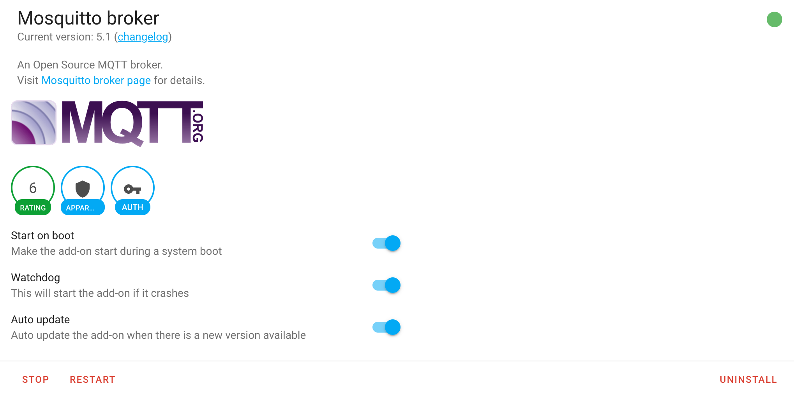

# `JETSON.md` - Motion &Atilde;&#128065; on Jetson Nano

This document details the installation instructions for Motion &Atilde;&#128065; on a Jetson Nano developer kit (4GB) using JetPack 4.

## nVidia Jetson Nano
The nVidia Jetson Nano is configured using the nVidia [Developer Kit](https://developer.nvidia.com/embedded/jetson-nano-developer-kit) and provide GPU accelerated hardware for a variety of artificial intelligence, computer vision, and other high-performance computing algorithms.

1. microSD card slot for main storage
2. 40-pin expansion header
1. Micro-USB port for 5V power input, or for Device Mode
1. Gigabit Ethernet port
1. USB 3.0 ports (x4)
1. HDMI output port
1. DisplayPort connector
1. DC Barrel jack for 5V power input
1. MIPI CSI-2 camera connectors


## Required components

1. [nVidia Jetson Nano developer kit; 4GB required](https://www.amazon.com/NVIDIA-Jetson-Nano-Developer-945-13450-0000-100/dp/B084DSDDLT/)
1. [4+ amp power-supply](https://www.adafruit.com/product/1466) or [another option](https://www.sparkfun.com/products/14932)
2. [High-endurance micro-SD card; _minimum_: 64 Gbyte](https://www.amazon.com/gp/product/B07P3D6Y5B)
3. One (1) jumper or [female-female wire for enabling power-supply](https://www.amazon.com/EDGELEC-Breadboard-Optional-Assorted-Multicolored/dp/B07GD2BWPY)
4. [Fan; 40x20mm; cool heat-sink](https://www.amazon.com/gp/product/B071W93333)
5. [SSD disk; optional; recommended: 250+ Gbyte](https://www.amazon.com/Samsung-250GB-Internal-MZ-76E250B-AM/dp/B07864WMK8)
6. [USB3/SATA cable and/or enclosure](https://www.amazon.com/gp/product/B07F7WDZGT)


<hr>

# &#10122; Hardware
To install on a Jetson Nano you will need the following items in addition to the device and its required components:

1. USB keyboard and mouse
2. HDMI cable and monitor
3. Internet connection via Ethernet cable

There are nine (9) steps:

1. Download [JetPack disk image](https://developer.nvidia.com/jetson-nano-sd-card-image)
2. Install [Balena Etcher](https://www.balena.io/etcher/)
3. Flash micro-SD (uSD) card (64 Gbyte) using Etcher
4. Install jumper or female-female connertor wire
5. Insert uSD card into Jetson
6. Attach power-supply DC barrel-jack
7. Configure for high-performance
8. Enable remote access
9. Reboot

## Step 1
This download is large, over six (6) gigabytes (GB); ensure sufficient disk space.  Download the [JetPack](https://developer.nvidia.com/jetson-nano-sd-card-image) from nVidia over the Internet.

## Step 2
Download and install [Balena Etcher](https://www.balena.io/etcher/) for your operating system (macOS, Windows, LINUX).

## Step 3

The Jetson image file is typically saved in the `Downloads` folder with a name ending in `zip` extension, for example: `jetson-nano-4gb-jp441-sd-card-image.zip` (n.b. there is no need to `unzip` this file; Etcher will do that automatically).

+ Run the Etcher program and select the downloaded Jetpack.
+ Insert micro-SD card -- using an appropriate adapter -- directly into the host computer
+ Select the corresponding drive (aka _device_) in the Etcher user-interface.
+ Flash the drive with the image.


## Step 4
Install jumper or female-female connector wire on jumper 48 (`J48`) located on left ide in image below.  This jumper enables the use of the _Power Jack_ (`J25`) for best performance (see [here](https://forums.developer.nvidia.com/t/power-supply-considerations-for-jetson-nano-developer-kit/71637) for more information).


## Step 5
Insert micro-SD (uSD) card into receiver which is on the side opposite the ports; note that the card is spring-loaded and is removed by pushing down to release.


## Step 6
Attach USB keyboard, mouse, HDMI monitor, and power supply using DC barrel jack connector (n.b. `J25` in diagram in Step 4); **do not use USB-C power** as performance will be limited.


## Step 7
After completing installation steps, the system will boot and request a username and password for the initial administrative account, complete software installation, and display the system keyboard shortcuts (see below):


The Jetson Nano out-of-the-box is set to low power; enabling the best performance requires both the larger power-supply and jumper as well as software configuration. 

Start a `terminal` session by right-clicking on the backround and selecting **Terminal** from the list.  Copy and paste the following commands to create the file `/etc/rc.local` which will run on every reboot and ensure complete GPU and CPU capabilities.

```
sudo -s
cat > /etc/rc.local << EOF
#/bin/bash

/usr/bin/jetson_clocks
for i in $(echo /sys/devices/system/cpu/cpu*/online); do echo 1 > $i; done

exit 0
EOF
chmod 755 /etc/rc.local
```

## Step 8
Enable remote access by installing `ssh` command, for example:

```
sudo apt install -qq -y ssh
```

## Step 9
Reboot the Jetson, for example:

```
sudo reboot
```

When the system reboots it will be ready for installation of Motion &Atilde;&#128065;.

<hr>

# &#10123; Motion &Atilde;&#128065;
The installation of the Motion &Atilde;&#128065; software requires an Internet connection; the Jetson Nano will need to be attached to a network via Ethernet cable.

There are seven (7) steps:

2. Install Motion AI
3. Setup MQTT broker
4. Add `github.com/dcmartin/hassio-addons` to **Add-on Store**
4. Install Motion Classic _add-on_
4. Configure Motion Classic _add-on_
4. Start Motion Classic _add-on_
5. Restart Motion AI

## Step 1
Install Motion-AI from the Github [repository](http://github.com/dcmartin/motion-ai) by cloning using the `git` command and running the installation script, for example:

```
sudo apt update -qq -y
sudo apt install -qq -y make git curl jq
git clone http://github.com/dcmartin/motion-ai
cd ~/motion-ai
sudo ./sh/get.motion-ai.sh
make
```

The `get.motion-ai.sh` script will upgrade the operating sytem components, install all pre-requisites, and initialize.

## Step 2
Install and configure a MQTT broker for sending and receiving messages.  There is a default MQTT broker _add-on_ provided in the Home Assistant **Add-on Store**, for example:


Configure the broker; a `username` and `password` are required; defaults are `username` and `password`:


Start the broker setting options `Start on boot`, `Watchdog` and `Auto update`:



Alternative MQTT brokers may be utilized by specifying the `MQTT` [options](OPTIONS.md) utilizing specified variables; see [`config.h`](../config.sh) for example.

## Step 3
Add [`http://github.com/dcmartin/hassio-addons`](http://github.com/dcmartin/hasio-addons) to the list of repositories using the menu from upper right corner in the store (see diagram in Step 3 above).


## Step 4
Install the `Motion Classic` _add-on_ from the `DCMARTIN Hass.io Addons for Home Assistant`:


## Step 5
Configure the _add-on_ for cameras to be utilized; the default is for one (1) local camera on `/dev/video0`.

The `!secret` values are derived from the configuration of Motion &Atilde;&#128065; using the [options](OPTIONS.md) when specified; for example the `MOTION_DEVICE` variable will effect `!secret motion-device`.


## Step 6
Start the _add-on_ setting options `Start on boot`, `Watchdog`, `Auto update`, and `Show in sidebar`:


## Step 7
Restart the Motion AI system from the command-line, for example:

```
cd ~/motion-ai
make restart
```

<hr>

# &#10124; Install external SSD
Add external SSD hard drive:

```
sudo -s
mkdir /sda
echo '/dev/sda /sda /ext4' >> /etc/fstab
mount -a
```

Install `rsync`

```
sudo apt install -y rsync
```

Relocate `/var/lib/docker` to SSD:

```
sudo -s
systemctl stop docker
rsync -a /var/lib/docker /sda/docker
rm -fr /var/lib/docker
ln -s /sda/docker /var/lib/docker
systemctl start docker
```

Relocate `/home` to SSD:

```
sudo -s
rsync -a /home /sda/home
rm -fr /home
ln -s /sda/home /home
```
