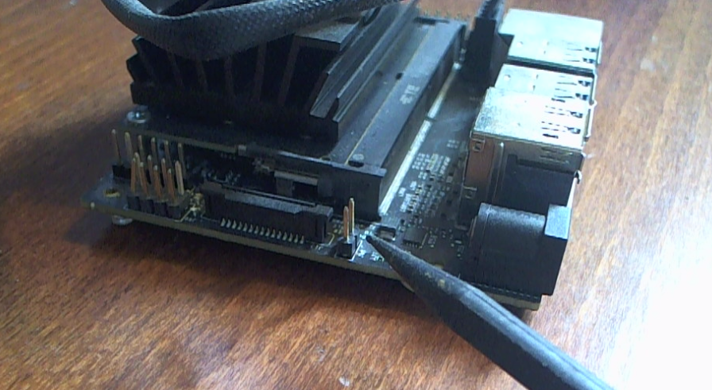
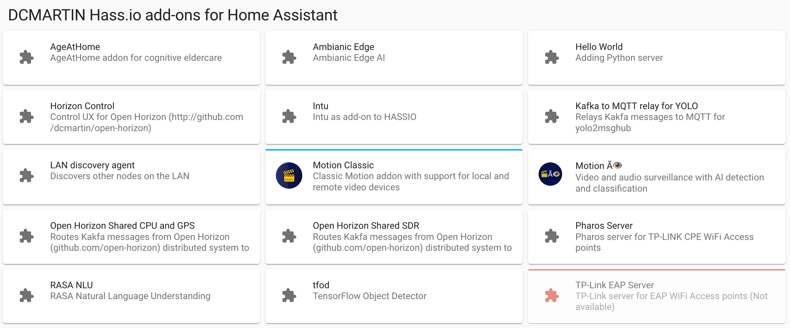

# `JETSON.md` - Motion &Atilde;&#128065; on Jetson Nano

This document details the installation instructions for Motion &Atilde;&#128065; on a Jetson Nano developer kit (4GB) using JetPack 4.

## nVidia Jetson Nano
The nVidia Jetson Nano is configured using the nVidia [Developer Kit](https://developer.nvidia.com/embedded/jetson-nano-developer-kit) and provide GPU accelerated hardware for a variety of artificial intelligence, computer vision, and other high-performance computing algorithms.

1. microSD card slot for main storage
2. 40-pin expansion header
1. Micro-USB port for 5V power input, or for Device Mode
1. Gigabit Ethernet port
1. USB 3.0 ports (x4)
1. HDMI output port
1. DisplayPort connector
1. DC Barrel jack for 5V power input
1. MIPI CSI-2 camera connectors


## Required components

1. [nVidia Jetson Nano developer kit; 4GB required](https://www.amazon.com/NVIDIA-Jetson-Nano-Developer-945-13450-0000-100/dp/B084DSDDLT/)
1. [4+ amp power-supply](https://www.adafruit.com/product/1466) or [another option](https://www.sparkfun.com/products/14932)
2. [High-endurance micro-SD card; _minimum_: 64 Gbyte](https://www.amazon.com/gp/product/B07P3D6Y5B)
3. One (1) jumper or [female-female wire for enabling power-supply](https://www.amazon.com/EDGELEC-Breadboard-Optional-Assorted-Multicolored/dp/B07GD2BWPY)
4. [Fan; 40x20mm; cool heat-sink](https://www.amazon.com/gp/product/B071W93333)
5. [SSD disk; optional; recommended: 250+ Gbyte](https://www.amazon.com/Samsung-250GB-Internal-MZ-76E250B-AM/dp/B07864WMK8)
6. [USB3/SATA cable and/or enclosure](https://www.amazon.com/gp/product/B07F7WDZGT)


<hr>

# &#10122; Hardware
To install on a Jetson Nano you will need the following items in addition to the device and its required components:

1. USB keyboard and mouse
2. HDMI cable and monitor
3. Internet connection via Ethernet cable

There are nine (9) steps:

1. Download [JetPack 4.4.1 disk image](https://developer.nvidia.com/jetson-nano-sd-card-image-441)
2. Install [Balena Etcher](https://www.balena.io/etcher/)
3. Flash micro-SD (uSD) card (64 Gbyte) using Etcher
4. Install jumper or female-female connector wire
5. Insert uSD card into Jetson
6. Attach power-supply DC barrel-jack
7. Configure for high-performance
8. Enable remote access
9. Reboot

## Step 1
This download is large, over six (6) gigabytes (GB); ensure sufficient disk space.  Download the [JetPack](https://developer.nvidia.com/jetson-nano-sd-card-image-441) from nVidia over the Internet.

## Step 2
Download and install [Balena Etcher](https://www.balena.io/etcher/) for your operating system (macOS, Windows, LINUX).

## Step 3

The Jetson image file is typically saved in the `Downloads` folder with a name ending in `zip` extension, for example: `jetson-nano-4gb-jp441-sd-card-image.zip` (n.b. there is no need to `unzip` this file; Etcher will do that automatically).

+ Run the Etcher program and select the downloaded Jetpack.
+ Insert micro-SD card -- using an appropriate adapter -- directly into the host computer
+ Select the corresponding drive (aka _device_) in the Etcher user-interface.
+ Flash the drive with the image or URL: `https://developer.nvidia.com/jetson-nano-sd-card-image`


## Step 4
Install jumper or female-female connector wire on jumper 48 (`J48`) located on left side in image below.  This jumper enables the use of the _Power Jack_ (`J25`) for best performance (see [here](https://forums.developer.nvidia.com/t/power-supply-considerations-for-jetson-nano-developer-kit/71637) for more information).





## Step 5
Insert micro-SD (uSD) card into receiver which is on the side opposite the ports; note that the card is spring-loaded and is removed by pushing down to release.


## Step 6
Attach USB keyboard, mouse, HDMI monitor, and power supply using DC barrel jack connector (n.b. `J25` in diagram in Step 4); **do not use USB-C power** as performance will be limited.


## Step 7
After completing installation steps, the system will boot and request a username and password for the initial administrative account, complete software installation, and display the system **Keyboard Shortcuts** which is dismissed via the _circle-X_ in the upper-left corner; see below. 


After logging into the Jetson, start a `terminal` session by right-clicking on the backround and selecting **_Terminal_** from the list. 

### Optional - Enabling all CPUs

Sometimes the system (under JetPack 4.4) does not enable all CPUs.  To force use of all CPUs, **copy and paste** the following commands into the _terminal_; password may be requested.

```
sudo -s
cat > /etc/rc.local << EOF
#/bin/bash

/usr/bin/jetson_clocks
for i in $(echo /sys/devices/system/cpu/cpu*/online); do echo 1 > $i; done

exit 0
EOF
chmod 755 /etc/rc.local
```

The Jetson Nano out-of-the-box is set to low power; enabling the best performance requires both the larger power-supply and jumper as well as software configuration. The setup process _should_ ask for confirmation of `MAXN` power; see graphic above in upper-right corner.

## Step 8
Setup automated `sudo` for the current user account; **copy and paste** the following into the _terminal_:

```
echo "${USER} ALL=(ALL) NOPASSWD: ALL" | sudo tee /etc/sudoers.d/010_${USER}-nopasswd
```

## Step 9
Install pre-requisite software components and enable remote access by installing `ssh` command; **copy and paste** the following into the _terminal_:

```
sudo apt update -qq -y
sudo apt install -qq -y make curl git jq apt-utils ssh
```

### Note: JetPack version 4.4.1
JetPack 4.4.1 has an [issue](https://forums.developer.nvidia.com/t/dist-uopgrade-fails-on-l4t-bootloader/121346/5) with the bootloader; to eliminate this issue, edit the file below using the `sed` command to delete lines 733 to 762; make a backup copy, for example:

```
cp /usr/sbin/l4t_payload_updater_t210 /usr/sbin/l4t_payload_updater_t210.orig
sed -e '733,762d' -i /usr/sbin/l4t_payload_updater_t210
```

## Step 10 - Python & `jtop` _(optional)_
Install Python version3 and the `jtop` command from the [`jetson-stats`](https://pypi.org/project/jetson-stats/) package:


To install `jetson-stats` **copy and paste** the following into the _terminal_:

```
sudo apt install -qq -y python3-dev libpython3-dev python3-pip
sudo python3 -m pip install --upgrade pip 
sudo pip3 install jetson-stats
```

## Step 11 - `VNC` _(optional)_
VNC (Virtual Network Computing) enables you to control your Jetson developer kit from another computer on the same network, by viewing and interacting with the desktop of the developer kit from the other computer.


Install VNC server using these [instructions](https://developer.nvidia.com/embedded/learn/tutorials/vnc-setup).


## Step _last_ - `reboot`
Reboot Jetson Nano to ensure all changes are applied.

```
sudo reboot
```

When the system reboots it will be ready for installation of Motion &Atilde;&#128065;.

<hr>

# &#10123; Motion &Atilde;&#128065;
The installation of the Motion &Atilde;&#128065; software requires an Internet connection; the Jetson Nano will need to be attached to a network via Ethernet cable.

There are seven (7) steps:

1. Install Motion AI
1. Setup MQTT broker
1. Add `github.com/dcmartin/hassio-addons` to **Add-on Store**
1. Install Motion Classic _add-on_
1. Configure Motion Classic _add-on_
1. Start Motion Classic _add-on_
1. Restart Motion AI

## Step 1

Install Home-Assistant supervised installation pre-requisites:
```
sudo apt update -qq -y
sudo apt install -qq -y apparmor jq wget curl udisks2 libglib2.0-bin network-manager dbus systemd-journal-remote grub2-common
sudo touch /etc/default/grub
```

Install Docker-CE
```
sudo apt install apt-transport-https ca-certificates curl software-properties-common
curl -fsSL https://download.docker.com/linux/ubuntu/gpg | sudo apt-key add -
sudo add-apt-repository "deb [arch=arm64] https://download.docker.com/linux/ubuntu `lsb_release -cs` test"
sudo apt update
sudo apt install docker-ce
```

Get most recent platform-dependent OS Agent:
```
wget https://github.com/home-assistant/os-agent/releases/download/1.4.1/os-agent_1.4.1_linux_aarch64.deb
sudo dpkg -i os-agent_1.4.1_linux_aarch64.deb
```

Get most recent platform-independent Supervised installer:
```
wget https://github.com/home-assistant/supervised-installer/releases/latest/download/homeassistant-supervised.deb
sudo dpkg -i homeassistant-supervised.deb
```

Modify supervisor source code for addons; requires restart; recommended reboot.
```
docker exec -it hassio_supervisor bash << EOF
sed -i -e 's/conditions=ADDON_UPDATE_CONDITION/conditions=[]/' /usr/src/supervisor/supervisor/addons/__init__.py
EOF
```

Return Docker configuration for Jetson to original; requires restart; recommended reboot.
```
cat > /etc/docker/daemon.json << EOF
{
  "runtimes": {
    "nvidia": {
      "path": "/usr/bin/nvidia-container-runtime",
      "runtimeArgs": []
    }
  },
  "log-driver": "journald",
  "storage-driver": "overlay2",
  "default-runtime": "nvidia",
  "experimental": true
}
EOF
```

<b>REBOOT</b>

When system has successfully installed `ha-cli` docker container (e.g. after reboot); turn of `healthy` check:
```
ha jobs options --ignore-conditions healthy
```

## Step 2

Install Motion-AI from the Github [repository](http://github.com/dcmartin/motion-ai) using the following commands:
```
sudo mkdir /usr/share/hassio
sudo chmod 775 /usr/share/hassio
cd /usr/share/hassio
git clone http://github.com/dcmartin/motion-ai .
make
```

The above will upgrade the operating sytem components, install all pre-requisites, and initialize.    First step is to connect to the Home Assistant server at `http://127.0.0.1:8123` using the installed Chromium browser (n.b. see icon on the desktop).


Once the Home Assistant server has been configured, the system will display an initial view without any cameras configured.


## Step 3
Install and configure a MQTT broker for sending and receiving messages.  There is a default MQTT broker _add-on_ provided in the Home Assistant **Add-on Store**, for example:


Configure the broker; a `username` and `password` are required; defaults are `username` and `password`:


Start the broker setting options `Start on boot`, `Watchdog` and `Auto update`:


Alternative MQTT brokers may be utilized by specifying the `MQTT` [options](OPTIONS.md) utilizing specified variables; see [`config.h`](../config.sh) for example.

## Step 3
Add [`http://github.com/dcmartin/hassio-addons`](http://github.com/dcmartin/hasio-addons) to the list of repositories using the menu from upper right corner in the store (see diagram in Step 3 above).


## Step 4
Install the `Motion Classic` _add-on_ from the `DCMARTIN Hass.io Addons for Home Assistant`:



## Step 5
Configure the _add-on_ for cameras to be utilized; the default is for one (1) local camera on `/dev/video0`.

The `!secret` values are derived from the configuration of Motion &Atilde;&#128065; using the [options](OPTIONS.md) when specified; for example the `MOTION_DEVICE` variable will effect `!secret motion-device`.


## Step 6
Start the _add-on_ setting options `Start on boot`, `Watchdog`, `Auto update`, and `Show in sidebar`:


## Step 7
Restart the Motion AI system from the command-line, for example:

```
cd ~/motion-ai
make restart
```

<hr>

# &#10124; Install external SSD
Add external SSD storage device and copy Docker and user home directories from SD card to external SSD; use the `lsblk` command to identify the actual identifier.

```
sudo lsblk
```
_Example output_:

```
NAME         MAJ:MIN RM   SIZE RO TYPE MOUNTPOINT
loop0          7:0    0    16M  1 loop 
sda            8:0    0 223.6G  0 disk /media/dcmartin/336fb189-d569-46ce-b271-02cb8e46d27d
mtdblock0     31:0    0     4M  0 disk 
mmcblk0      179:0    0  29.8G  0 disk 
├─mmcblk0p1  179:1    0  29.8G  0 part /
├─mmcblk0p2  179:2    0   128K  0 part 
├─mmcblk0p3  179:3    0   448K  0 part 
├─mmcblk0p4  179:4    0   576K  0 part 
├─mmcblk0p5  179:5    0    64K  0 part 
├─mmcblk0p6  179:6    0   192K  0 part 
├─mmcblk0p7  179:7    0   576K  0 part 
├─mmcblk0p8  179:8    0    64K  0 part 
├─mmcblk0p9  179:9    0   640K  0 part 
├─mmcblk0p10 179:10   0   448K  0 part 
├─mmcblk0p11 179:11   0   128K  0 part 
└─mmcblk0p12 179:12   0    80K  0 part 
```

## Copy `root` from uSD to SSD
The micro-SD (uSD) card has limited performance and lifetime compared to an external SSD; to utilize the SSD rather than the uSD, perform the following tasks.

Use the command-line in Terminal application to run the `parted` command and create a partition of the same size as the uSD card; for example using a 64 GB card:

```
# become root
sudo -s
# define external disk target (see lsblk output)
DISK=sda
# run parted command for that disk (e.g. /dev/sda)
parted /dev/${DISK}
# enter the following command in `parted` to label the external SSD
mklabel msdos
# enter the following command in `parted` to make a partition
mkpart
# enter the following values for `mkpart` when prompted
# type
primary
# filesystem
ext4
# starting 
0
# ending (for 64GB uSD) and ignore any alignment
64GB
# create another primary partition for the remainder of the disk; starting at 64GB to 100%
mkpart
primary
ext4
64GB
100%
# again, ignore alignment

# when complete, enter the quit command
quit
```

After the partition has been created on the external SSD, make a file-system; for example:

```
mkfs -t ext4 /dev/${DISK}1
mkfs -t ext4 /dev/${DISK}2
```

When the file-system has been created, copy the uSD card partition to the SSD partition file-system; for example:

```
e2image -ra -p /dev/mmcblk0p1 /dev/${DISK}1 -f
```

Label the disk as `APP`; for example:
```
e2label /dev/${DISK}1 APP
```

Mount the external SSD partition file-system in a temporary location and edit the boot configuration to utilize the external SSD; for example:

```
mount /dev/${DISK}1 /mnt
sed -i -e "s/mmcblk0p1/sda1/" /mnt/boot/extlinux/extlinux.conf
```

Create directory on external SSD `/` file-system for second partition file-system (n.b. `/dev/sda2`) and add to file-system mounting:
```
mkdir /mnt/sda
echo "/dev/sda2 /sda ext4 defaults 0 1" >> /mnt/etc/fstab
```

Mount the second partition on the external SSD to a temporary directory:
```
mkdir /sda
mount /dev/${DISK}2 /sda
```

Relocate the `/home` directory on the external SSD from the first partition file-system  to the second:
```
rsync -a /mnt/home/ /sda/home/
rm -fr /mnt/home
ln -s /sda/home /mnt/home
```

Relocate the `/var/lib/docker` directory on the external SSD from the first partition file-system to the second:
```
rsync -a /mnt/var/lib/docker/ /sda/docker/
rm -fr /mnt/var/lib/docker
ln -s /sda/docker /mnt/var/lib/docker
```

Shutdown the Jetson, unplug the power from the barrel connector, remove the uSD card, and plug back in the power to restart. To shutdown cleanly, run the following command:

```
sudo shutdown now
```

## Copy `home` and `docker` only
Unmount device (e.g. mounted above as `/media/dcmartin/336fb189-d569-46ce-b271-02cb8e46d27d`) and then make a new file-system, for example:

```
sudo umount /dev/sda
sudo mkfs -t ext4 /dev/sda
```

```
sudo -s
mkdir /sda
echo '/dev/sda /sda ext4 defaults 0 1' >> /etc/fstab
mount -a
```

If the `rsync` command was not installed previously, install using the following command:

```
sudo apt install -qq -y rsync
```

Relocate `/var/lib/docker` to SSD:

```
sudo -s
systemctl stop docker
rsync -a /var/lib/docker /sda/docker
rm -fr /var/lib/docker
ln -s /sda/docker /var/lib/docker
systemctl start docker
```

Relocate `/home` to SSD:

```
sudo -s
rsync -a /home /sda/home
rm -fr /home
ln -s /sda/home /home
```

<hr>

# &#10125; Setup WiFi
Add external WiFi USB adapter, for example a [TPLink TL-WN722N](https://www.tp-link.com/us/home-networking/usb-adapter/tl-wn722n/) adapter.

```
sudo -s
cat > /etc/NetworkManager/conf.d/default-wifi-powersave-on.conf << EOF
[connection]
wifi.powersave = 2
EOF
```

```
nmcli device wifi list
```

```
SSID="MyNetwork"
PSK="MyPassowrd"
sudo nmcli dev wifi connect ${SSID} password ${PSK}
```
man find own
